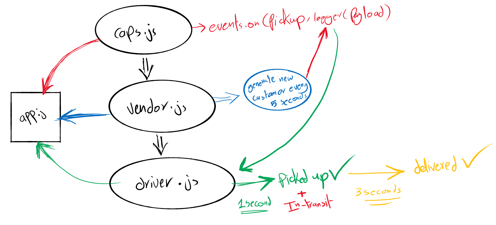

# Hub-server

### Author: Diana Alazzam 

### Links and Resources

- [Pull request](https://github.com/diana96alazzam-401-advanced-javascript/hub-server/pull/2)
- [ci/cd](https://github.com/diana96alazzam-401-advanced-javascript/hub-server/blob/lab-16/.github/workflows/node.yml) (GitHub Actions)
<!-- - [back-end server url]() -->

### Setup

#### `.env` requirements
- `STORE_NAME=diana`

#### How to initialize/run this application

- `node app.js`

#### Tests

- `npm run lint`
- `npm test`

#### UML

